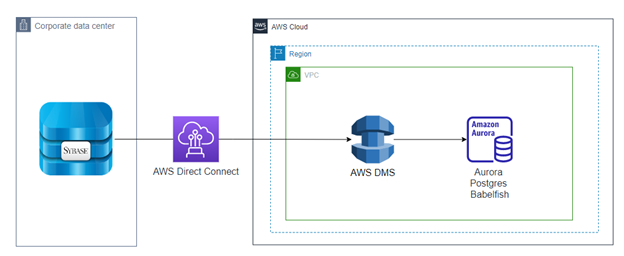
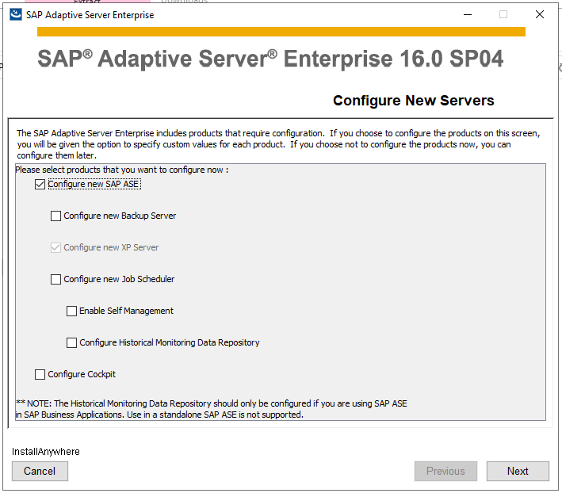
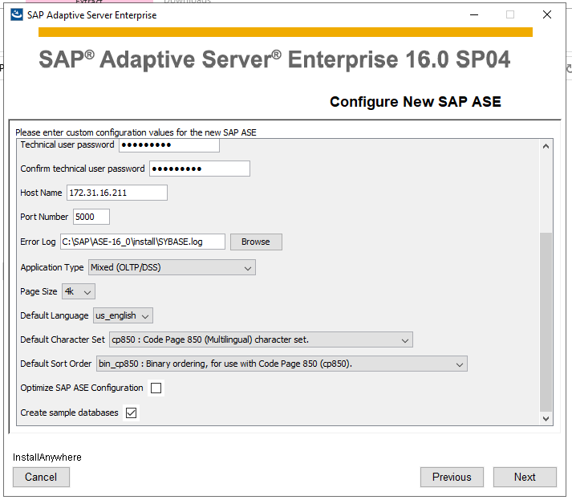

# Welcome to your CDK C# project Sybase to Aurora Postgres babelfish Migration

This AWS CDK project provides source code for [Blogpost](todo: Link) resources to migrate data from a Sybase database to an Aurora PostgreSQL database using AWS Database Migration Service (DMS). The project creates an Amazon Virtual Private Cloud (VPC) with public subnets and security groups, deploys a Sybase database instance, an Aurora PostgreSQL database cluster with Babelfish enabled, database secrets and sets up a DMS replication task between them.

## Prerequisites

Before you begin, ensure you have the following:

* An AWS account
* [AWS CLI](https://docs.aws.amazon.com/cli/latest/userguide/getting-started-install.html) installed and configured
* [AWS CDK](https://docs.aws.amazon.com/cdk/v2/guide/getting_started.html)
* AWS SDK for .NET
* IAM Permissions: You should have the necessary IAM (Identity and Access Management) permissions to create and manage DMS resources in your AWS account. You can create a new IAM user or use an existing one with the necessary permissions.

The `cdk.json` file tells the CDK Toolkit how to execute your app.

It uses the [.NET CLI](https://docs.microsoft.com/dotnet/articles/core/) to compile and execute your project.

## Deployment

To deploy the stack, follow these steps:

1. Clone the repository:

        `$ git clone https://github.com/okomissarov/SybaseToAuroraBlog.git`

        `$ cd SybaseToAuroraBlog`
2. Deploy stack
        `cdk deploy`

Confirm the changes by typing y, then wait for the deployment to complete
File [SybaseToAuroraBlogStack.cs](/src/SybaseToAuroraBlog/SybaseToAuroraBlog.csproj) has definition of IP address that can access security group. please modify it to your IP address to allow connectivity only from your public IP

        `private const string MyIpAddress = "<your IP./32";'

## Useful commands

* `dotnet build src`    compile this app
* `cdk deploy`          deploy this stack to your default AWS account/region
* `cdk diff`            compare deployed stack with current state
* `cdk synth`           emits the synthesized CloudFormation template
* `cdk destroy`         clean up/destroy stack

## Usage

After the stack has been deployed, you can use AWS DMS to migrate data from the Sybase database to the Aurora PostgreSQL database.

Log in to AWS Console

Update connection parameters for a sybaseSecret a secret in AWS Secrets Manager with the connection details for the Sybase database instance.

Test connections to source and target in DMS Console

Start the DMS replication task to migrate data from the Sybase database to the Aurora PostgreSQL database.

## Cleanup

To delete the stack and all associated resources, run the following command:

        `cdk destroy`

Confirm the changes by typing y, then wait for the deletion to complete.

## Stack Resources

This stack creates the following AWS resources:

* `NetworkResourcesStack.cs` - This file creates an Amazon VPC along with its necessary network resources such as subnets, routing tables, and internet gateways. It also creates an Amazon EC2 Security Group for network traffic access control.
* `DmsResourcesConstruct.cs` - This file creates the AWS DMS resources such as Replication Instance, Endpoints, and Replication Task.
* `SybaseToAuroraBlogStack.cs` - This file creates the Amazon Aurora PostgreSQL database cluster, VPC endpoints, Secrets manager secrets and IAM roles and policies required for DMS resources. It also creates dependencies on previously created resources such as Amazon VPC and EC2 Security Group. This file also initializes the C# objects used to configure and create the resources.
* `Program.cs` - This file is the entry point of the CDK application and instantiates the CDK App and the main stack created by SybaseToAuroraBlogStack.cs. It also includes the Main method which is responsible for synthesizing and deploying the stack.

## How to set (manually) up ASE SAP Sybase with pubs3 test database on AWS EC2

**Step #1** - create EC2 instance

1. Log in to the AWS Management Console and navigate to the EC2 Dashboard.

2. Click on the "Launch Instance" button to launch a new instance.

3. Choose the Amazon Machine Image (AMI) for Windows Server 2022 Base.

4. Select the "m4.2xlarge" instance type from the list of available instance types.

5. Choose the VPC created by the stack that has a public IP.

6. Make sure to allow inbound traffic to port 5000 (Sybase port) and RDP in security group.

7. Review the instance settings and click on the "Launch" button.

8. Create a new key pair or select an existing one to secure access to the instance, decrypting RDP password

9. Wait for the instance to launch and check the status in the EC2 Dashboard. Once the status changes to "running," you can connect to the instance using RDP.

10 To connect to the instance, right-click on the instance and select "Connect." Follow the instructions to connect to the instance using RDP. You should be able to successfully RDP to EC2 instance

**Step #2** - configure Sybase with pubs3 test database

1. Download and install Sybase ASE

You can download the installation files for Sybase ASE from SAP's website. Follow the instructions in the installation wizard to install Sybase ASE on your Windows Server 2022 EC2 instance

* Select "Typical" consfiguration
* Select "Evaluate SAP Adaptive Server Enterprise"
* Select "Configure new Instance"

    

* Select checkbox "Create sample databases" - this is important, pups2 and pubs3 will be added to server

    

2. Configure inbound rules

* Open the "Windows Defender Firewall with Advanced Security" tool. You can find it by searching for "Windows Defender Firewall" in the Start menu.

* In the left pane, click on "Inbound Rules".

* In the right pane, click on "New Rule..." to open the New Inbound Rule Wizard.

* In the first page of the wizard, select "Port" and click "Next".

* In the next page, select "TCP" and enter "5000" as the specific local port. Click "Next".

* In the next page, select "Allow the connection" and click "Next".

* In the next page, leave all options checked and click "Next".

* In the last page, give the rule a name (e.g. "Allow Sybase inbound traffic on port 5000") and click "Finish".

you should be able now to connect to Sybase instance using SQL tool of your choice or SSAM and use it in testing of migration to Postgres Babelfish

## License

This project is licensed under the terms of the MIT license.
